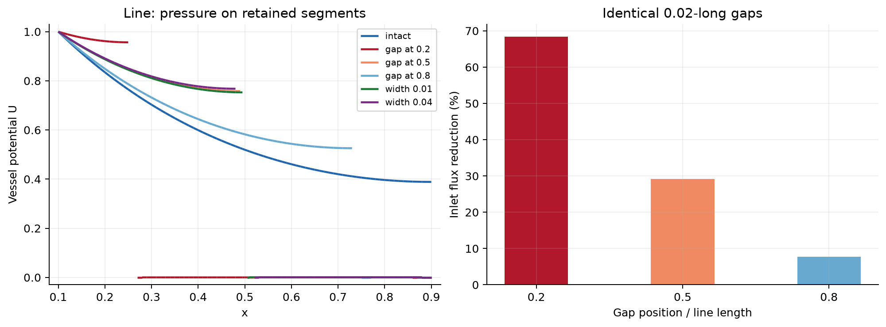
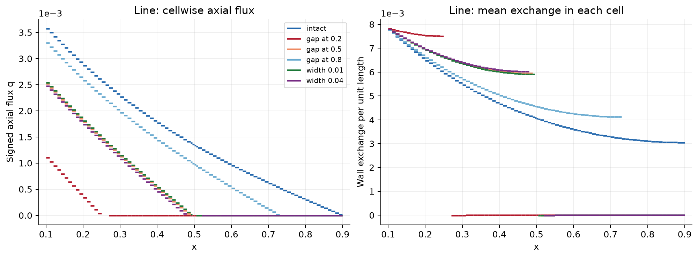
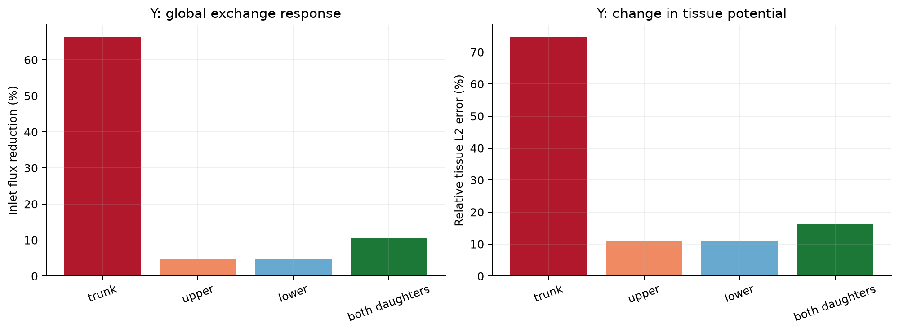
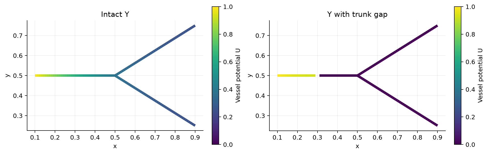
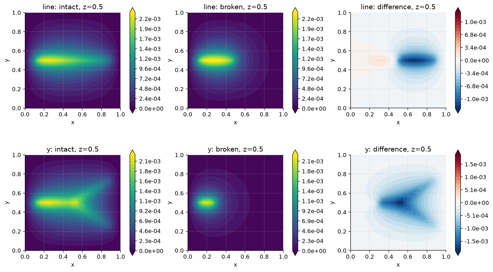
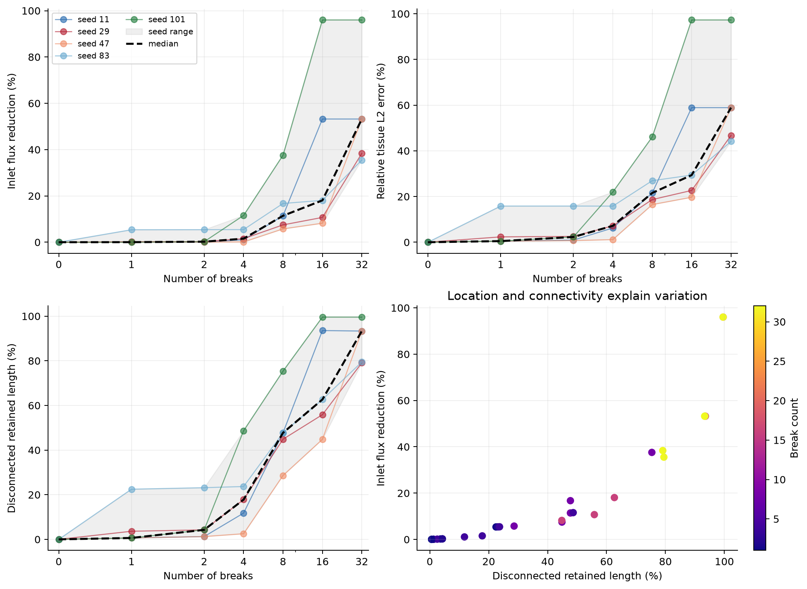
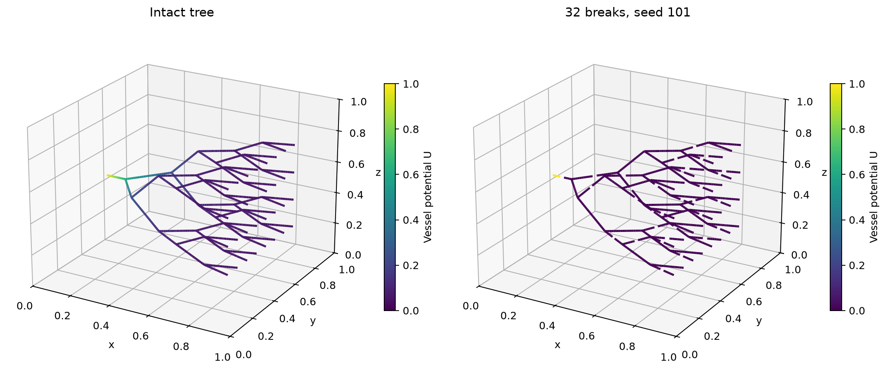
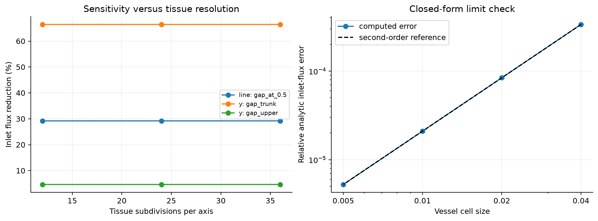

# Vessel-break sensitivity in a coupled 3D--1D model

Completed controlled pilot, 11 September 2026. All results are dimensionless and concern synthetic geometries.

Break location has a much larger effect than its small missing length alone suggests. For identical gaps removing 2.5% of a straight vessel, inlet-flux reductions are 68.39%, 29.20%, and 7.67% at 20%, 50%, and 80% of its length. A Y trunk break reduces inlet flux by 66.43%; a single daughter break reduces it by about 4.64%. In the larger tree, 32 breaks give a median reduction of 53.21% and a five-seed range of 35.52--96.00%.

## Scope and model

The solver follows the symmetric circular-average formulation in Laurino and Zunino (2019), equations (11)--(12), [DOI 10.1051/m2an/2019042](https://doi.org/10.1051/m2an/2019042). It replaces the upstream multihepatic physical model. In the unit tissue cube, the weak form is:

```text
Integral_Omega K3 grad(u).grad(v)
 + Integral_Lambda K1 A U_prime V_prime
 + Integral_Lambda kappa P (U - T_r u)(V - T_r v) = 0.
```

The original inlet has U=1; the tissue exterior has u=0. All other vessel endpoints, including the new break ends, have zero axial flux. There are no source terms. K3=K1=1, radius r=0.025, area A=pi r^2, perimeter P=2 pi r, and kappa=0.05. Axial flux is q=-K1 A dU/ds. The reported outflow exits through the tissue exterior; distal vessel endpoints are sealed. This is a potential/diffusion model, without a calibration to dimensional blood-flow rates.

Tissue and vessel potentials use continuous P1 finite elements. Circular averages use a separate DG1 space with branch-specific planes at junctions. Positive inlet data use explicit Dirichlet lifting. Fluxes are recovered from unconstrained-matrix reactions and independently checked against integrated wall exchange. Disconnected pieces remain coupled to tissue; neither their pressure nor their exchange is artificially set to zero.

For this parameter choice, peak intact tissue potential is only 0.232% of the inlet value in the line, 0.222% of the inlet value in the y, 0.266% of the inlet value in the tree. Tissue feedback on the supplied vessel is therefore weak in this pilot. The response is close to a leaky one-dimensional cable, while detached vessels can still redistribute tissue potential locally. Sensitivity magnitudes are specific to these coefficients and boundary conditions; they are not universal percentages for anatomical vessels.

## Controlled experiments

A break deletes a finite 0.02-long interval, except in the explicit line gap-width sweep. The interval boundaries are included in the intact discretization, so retained cells and the tissue mesh are identical in each comparison. Breaks do not remove an inlet or a junction. The line and Y use 82,944 tetrahedra. The larger 63-branch, 32-leaf tree uses 384,000 tetrahedra, 1,156 vessel cells and 70,078 total pressure unknowns.

Five fixed seeds (11, 29, 47, 83, 101) each generate a uniform permutation of branch IDs. The 1, 2, 4, 8, 16 and 32-break cases use nested prefixes of that permutation. There are 42 primary solves: six line cases, five Y cases and 31 tree cases. The shared intact tree is solved once. All selected branches lose an interval at their midpoint. Individual trajectories and the seed range are shown; five seeds are exploratory and do not establish a population confidence interval. All three intact test networks are trees, so every break adds a disconnected component. Networks containing loops can retain alternative supply paths and require a separate sensitivity study.

## Toy results

| Geometry | Case | Inlet flux reduction (%) | Tissue relative L2 error (%) | Detached retained length (%) |
| --- | --- | --- | --- | --- |
| line | gap_at_0.2 | 68.386 | 76.940 | 80.77 |
| line | gap_at_0.5 | 29.200 | 38.206 | 50.00 |
| line | gap_at_0.8 | 7.674 | 12.254 | 19.23 |
| line | gap_width_0.01 | 28.581 | 37.534 | 50.00 |
| line | gap_width_0.04 | 30.461 | 39.569 | 50.00 |
| y | gap_trunk | 66.432 | 74.833 | 85.64 |
| y | gap_upper | 4.644 | 10.895 | 17.07 |
| y | gap_lower | 4.645 | 10.882 | 17.07 |
| y | gap_both_daughters | 10.527 | 16.151 | 34.66 |











## Random-break results

| Breaks | Seeds / baselines | Median flux reduction (%) | Seed range (%) | Median tissue L2 error (%) |
| --- | --- | --- | --- | --- |
| 0 | 1 | 0.000 | -0.000 to -0.000 | 0.000 |
| 1 | 5 | 0.030 | 0.030 to 5.391 | 0.486 |
| 2 | 5 | 0.233 | 0.060 to 5.423 | 2.297 |
| 4 | 5 | 1.535 | 0.123 to 11.572 | 7.179 |
| 8 | 5 | 11.421 | 5.765 to 37.576 | 21.560 |
| 16 | 5 | 18.076 | 8.213 to 96.000 | 29.382 |
| 32 | 5 | 53.211 | 35.522 to 96.000 | 58.903 |





The inlet-flux response is monotone along every nested break sequence. Branch location and lost inlet connectivity explain why equal break counts can have very different effects. Detached components can still have nonzero potential and internal flow through tissue-mediated exchange, while their net wall exchange is zero. Vessel pressure and axial-flux L2 errors are computed on the retained vessel domain against the intact solution restricted to the same domain. Tissue L2 errors cover the full unchanged cube.

## Numerical validation

| Check | Result |
| --- | --- |
| Maximum inlet / wall / tissue-outflow imbalance | 8.051e-13 relative |
| Maximum linear residual | 2.157e-15 relative |
| Maximum energy-identity error | 2.121e-13 relative |
| One-, two-, eight-rank comparison | 1.785e-13 maximum relative difference |
| Doubling the positive inlet condition | 0.000e+00 maximum relative scaling error |
| Maximum detached-component net exchange / inlet flux | 9.049e-16 |
| Analytic-limit flux convergence | 2.000, 2.000, 2.000 observed orders |

The analytic limit takes K3=10^8, approaching zero tissue potential. Its vessel solution is U(s)=cosh((L-s)/ell)/cosh(L/ell), ell=sqrt(K1 A/(kappa P)). Halving vessel cell size from 0.04 to 0.005 gives the expected second-order flux convergence. Serial/MPI agreement compares both intact and broken cases, not only a communication test.

Changes when increasing the toy tissue grid from 24 to 36 subdivisions per axis:

| Geometry | Case | Flux-sensitivity change (percentage points) | Tissue-error change (percentage points) |
| --- | --- | --- | --- |
| line | gap_at_0.5 | 0.00234 | 0.15894 |
| y | gap_trunk | 0.00225 | 0.00805 |
| y | gap_upper | 0.00094 | 0.16375 |

Changes in selected tree cases when increasing the grid from 40 to 48 subdivisions per axis:

| Case | Absolute flux change (%) | Flux-sensitivity change (pp) | Tissue-error change (pp) |
| --- | --- | --- | --- |
| intact | 0.00088 | 0.00000 | 0.00000 |
| seed_11_breaks_8 | 0.00121 | 0.00029 | 0.03543 |
| seed_11_breaks_32 | 0.00262 | 0.00082 | 0.01336 |

The complete refinement tables include coarser grids, halved vessel cell size, and doubled circle quadrature degree in `validation_summary.json`. Integrated flux responses are more stable than spatial tissue-error measures; the latter retain visible discretization dependence. The large-tree refinement covers three selected cases, not every seed and break count.



## Files and reproducibility

* All figures, tables, and this combined report are together in this folder.
* `all_cases.csv`, `random_break_summary.csv`, and `break_intervals.csv` contain the synthetic-study measurements and gap definitions.
* The supplied-network solution and measurements appear in the supplement below.
* All runnable code is in `../src/`; instructions are in [the repository README](../README.md).
* Full per-case native meshes and raw run records remain on NOTS under `/scratch/pzz1/segmentation-sensitivity/` and in the earlier full-results archive. This compact repository retains the three supplied-network VTU solutions and all presentation figures and tables.
* The model and mesh construction code are local modules. No upstream patch is required. FEniCSx, PETSc, MPI, and fenicsx_ii are unmodified external dependencies.


# Supplied-network simulation: pt002 inflow

Completed supplement, 11 September 2026. This run solves the intact inflow network from `oilblooddata.zip`, coupled to its supplied tissue mesh. A second solve checks the effect of halving the vessel cell size. Results are dimensionless.

## Completed mesh files

* [coupled_solution.vtu](coupled_solution.vtu): self-contained tissue and vessel mesh with both computed potentials and flux fields. This is the main deliverable and needs no companion file.
* [network_solution.vtu](network_solution.vtu): vessel-only solution, convenient for a Tube filter in ParaView.
* [tissue_solution.vtu](tissue_solution.vtu): full tissue solution.
* [metrics.csv](supplied_metrics.csv): the main and refinement measurements.
* [verification.json](supplied_verification.json): numerical and artifact checks.

The VTU coordinates are in the original millimetre coordinate frame. `potential_dimensionless` contains tissue u and vessel U. Cell field `compartment_label` is 1 for tissue and 2 for the inflow network; select label 2 with Threshold to expose the embedded network. The axial and tissue flux names end in `dimensionless`; wall exchange is per unit normalized arclength and is positive from vessel to tissue. Signed axial flow follows the source VTP edge orientation. Fields belonging to the other compartment contain zero placeholders. Source VTK point and edge IDs are zero-based; `source_exodus_node_id` preserves the one-based Exodus node IDs. Newly inserted vessel points have source point ID -1. Native XDMF/HDF5 files in the raw run directory retain normalized coordinates.

## Data and inlet selection

The input files are `oilblooddata/thermoembo_run/pt002/pt002_inflow_centerline.vtp` and `oilblooddata/thermoembo_run/pt002/mesh.exo`. The archive README identifies the centerline coordinates as millimetres and the Exodus coordinates as metres. They were converted to one coordinate system before coupling.

The original network has 797 vertices, 828 edges, 55 endpoints, one connected component, and cycle rank 32. All edges and loops were retained, including 83 edges marked `is_phantom` in the source. Edge subdivision preserves their geometry and connectivity. All stored point and edge radii are 0.1 mm; this supplied value was retained rather than treated as a measured radius distribution.

The inlet is original point **0**, at **[66.1982421875, 99.6728515625, 475.5] mm**. It is the unique degree-one vertex with the highest archived endpoint pressure, 836 mmHg. This supplies an explicit computational inlet selection. Archived pressures and flows come from a different resistance model and are used only to identify this endpoint; they are not calibration or validation targets for the new PDE solution.

## Model and normalization

The model is the same Laurino-Zunino circular-average 3D-1D weak formulation used in the synthetic pilot:

```text
Integral_Omega K3 grad(u).grad(v)
 + Integral_Lambda K1 A U_prime V_prime
 + Integral_Lambda kappa P (U - T_r u)(V - T_r v) = 0.
```

K3=K1=1, kappa=0.05, A=pi*r^2, and P=2*pi*r. U=1 at the selected inlet; other vessel endpoints have natural zero axial flux. The entire exterior tissue boundary has u=0. Tissue and vessel potentials are continuous P1; circular averages use DG1 with quadrature degree 20. Source terms are zero. The circle checks include every endpoint interpolation location and additional midpoint samples.

Lengths are normalized by the longest extent of the supplied tissue mesh, L=202.380554199 mm, with origin [-0.11389311981201172, 0.041460384368896486, 0.408371337890625] metres. Thus r=0.0004941186192 in the PDE. The imported tissue mesh is preserved: 126,569 tetrahedra and 27,947 vertices. Its original volume is 887.609130 mL. The main vessel discretization has 2,016 cells and 1,985 vertices, with maximum normalized cell length 0.005 (about 1.0119 mm). The coupled system has 29,932 pressure degrees of freedom and was solved on 4 MPI ranks using PETSc/MUMPS.

These are model potentials and dimensionless fluxes. The coefficients and inlet value have not been fitted to physiological measurements. The explicit use of the supplied radius and organ domain also means the numerical percentages from the earlier synthetic examples should not be transferred to this network.

## Results

| Quantity | Computed value |
| --- | --- |
| Conservative inlet flux | 1.23142857635e-05 |
| Integrated vessel-to-tissue exchange | 1.23142857635e-05 |
| Tissue exterior outflow | 1.23142857635e-05 |
| Mean tissue potential (volume-normalized) | 3.08670848106e-07 |
| Maximum tissue nodal potential | 2.95045856171e-05 |
| Vessel nodal potential range | 1.43228924415e-11 to 1 |
| Assembly / linear solve time | 115.91 s / 0.29 s |

## Validation

| Check | Result |
| --- | --- |
| Maximum relative flux imbalance | 1.665e-14 |
| Relative linear residual | 1.234e-19 |
| Relative energy-identity error | 8.254e-16 |
| Positive inlet value | 1 |
| Main coupling containment | 66,528 samples; zero outside |
| Halved maximum 1D cell size | 3,564 vessel cells; inlet-flux change 0.009984% |
| Existing toy-model regression | 4.530e-14 maximum relative difference |
| Mesh preservation and VTU read-back | Passed |

The refinement check concerns the one-dimensional discretization on the supplied tissue mesh. It does not establish three-dimensional mesh convergence. Input checksums and the coordinate transformation are in `supplied_input_metadata.json`; source IDs are embedded in the VTU files. Both runs' metrics are in `supplied_metrics.csv`. Unmodified extracted inputs and native XDMF/HDF5 solutions remain with the raw runs on NOTS.

## Reproduce

From the study source directory on NOTS:

```bash
source src/environment.sh
python -m src.supplied --prepare
sbatch src/supplied.slurm
# After that job completes:
python -m src.supplied_results
python -m src.collect
python -m src.package
```

Reference: [Laurino and Zunino (2019), equations (11)-(12)](https://doi.org/10.1051/m2an/2019042).
